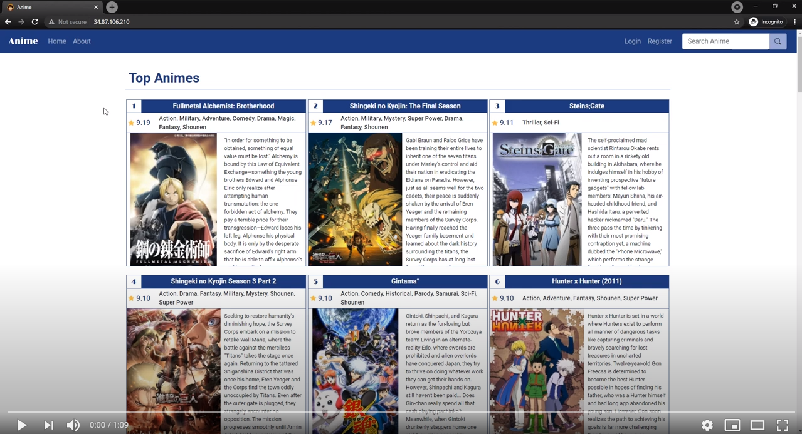

# Anime Recommendation

Visit the website [here](http://34.87.106.210/)!

## Built with
     

    

<br>

**DISCLAIMER:** This project's main priority is the **recommendation system** (**backend**) and ***not*** the the webpage functionalities (**frontend**). Therefore, the website will have some limitations in terms of the frontend components.

## Summary of the Project
- I was wondering how to find the best Animes based on my favorite Animes, and I'm not sure where to find. Then I thought, "Why not create one myself?" That's basically the motivation for this project.
- The Anime recommendation model used in the Website was built with a collaborative filtering model using the Anime dataset scraped from [MyAnimeList](https://myanimelist.net/) and shared in [Kaggle](https://www.kaggle.com/hernan4444/anime-recommendation-database-2020).
- The model was trained in Kaggle kernel using TPUs and the entire process can be referred in the notebook here: [cf_embedding.ipynb](https://github.com/ansonnn07/Anime-Recommendation/blob/main/web/cf_embedding.ipynb).
- The website is then deployed using Docker in a Virtual Machine (VM) instance created in the Google Compute Engine, which is an Infrastructure as a Service (IaaS) component offered by Google Cloud Platform.

**NOTE**: The website will be taken down by September 2021 because the free trial has ended by then and I would like to avoid unnecessary charges.

## Website and Demo
The website is accessible [here](http://34.87.106.210/) until September 2021.
- Originally, I was trying to deploy the website on the free tier on Heroku, but the 512MB RAM is really not enough for running a tensorflow model for inference, unfortunately. I will look for alternative in the future, but currently, this website is deployed on Google Compute Engine's VM instance using the 3-month free trial.
- I did not buy a domain name, and did not sign for a SSL certificate for this also. So the website is using HTTP instead of HTTPS, which will show the **"Not Secure"** at top left.
- You can try to register to make use of the **"Bookmark"** feature of the website but if you are afraid of security issues, just simply use any username and password. The password is also hashed using Flask Bcrypt before even sent to the database.

You can watch the video for the **DEMO of the website** here:

[](https://youtu.be/SgnyXSIhGR8)


## Main Notebooks for References
All the notebooks are inside the `web` folder. And the scripts used for building the website are in the `web/website` folder.

| Notebooks                                                                                                                      | Description                                                                                                                                                                                                                                                                                                            |
|--------------------------------------------------------------------------------------------------------------------------------|------------------------------------------------------------------------------------------------------------------------------------------------------------------------------------------------------------------------------------------------------------------------------------------------------------------------|
| [All Scrapping process.ipynb](https://github.com/ansonnn07/Anime-Recommendation/blob/main/web/All%20Scrapping%20process.ipynb) | This notebook came from the GitHub repo [here](https://github.com/Hernan4444/MyAnimeList-Database) which keep everything related to the data for the Kaggle dataset.                                                                                                                                                   |
| [cf_embedding.ipynb](https://github.com/ansonnn07/Anime-Recommendation/blob/main/web/cf_embedding.ipynb)                       | Notebook used for preparing the data and training the **collaborative filtering (CF) embedding model with neural networks**. This notebook is highly inspired by the amazing [Kaggle notebook](https://www.kaggle.com/chaitanya99/recommendation-system-cf-anime/) by [Chaitanya](https://www.kaggle.com/chaitanya99). You can also refer to this [embedding_model.py](https://github.com/ansonnn07/Anime-Recommendation/blob/main/web/website/embedding_model.py) file to see how to use the model for inference.|
| [collab_filter_rec.ipynb](https://github.com/ansonnn07/Anime-Recommendation/blob/main/web/collab_filter_rec.ipynb)             | This notebook shows the training of another **collaborative filtering model** which is not based on embeddings, but based on cosine similarity instead, and trained using an unsupervised K-Nearest Neighbor model instead of neural networks.                                                                         |
| [content_based_rec.ipynb](https://github.com/ansonnn07/Anime-Recommendation/blob/main/web/content_based_rec.ipynb)             | This notebook shows the training of **content-based recommendation model** based on cosine similarity and word-transformed vectors.                                                                                                                                                                                    |
| [scrape_img_synopsis.ipynb](https://github.com/ansonnn07/Anime-Recommendation/blob/main/web/scrape_img_synopsis.ipynb)         | This notebook shows the scraping process of the Anime image thumbnail URLs and more complete synopsis as the image URLs were not provided in the original dataset, and there were some words missing in the synopsis scraped in the original dataset.                                                                  |

### Notebooks used for Checking:
| Notebooks                                                                                                                      | Description                                               |
|--------------------------------------------------------------------------------------------------------------------------------|-----------------------------------------------------------|
| [check_sql_db.ipynb](https://github.com/ansonnn07/Anime-Recommendation/blob/main/web/check_sql_db.ipynb)                       | Checking the database contents directly using Python.     |
| [test_cf_embedding_model.ipynb](https://github.com/ansonnn07/Anime-Recommendation/blob/main/web/test_cf_embedding_model.ipynb) | Testing the trained CF embedding model for **inference**. |
| [web_functions.ipynb](https://github.com/ansonnn07/Anime-Recommendation/blob/main/web/web_functions.ipynb)                     | Testing some functions used in building the Flask routes. |

## Instructions for Deploying with Docker
**NOTE**: If you don't have Docker installed in your machine. Then follow the [instructions here at the docs](https://docs.docker.com/get-docker/) to install first.


**Deploying with the individual Website Dockerfile using DEBUG config**
- If you only want to deploy the individual website using the DEBUG config (using SQLite3 instead of PostgreSQL), then you can just run the following code to build the image and create a Docker container for it:

```
cd web
docker build -t <image-name> .
docker run <image-name>
```
Then visit the website at [**localhost**](http://localhost).
- To stop the Docker container:

Find the Docker CONTAINER ID with:
```
docker ps
```
Then kill it:
```
docker kill <container-id>
```
**Deploying with the Docker Compose**
- Create a copy of the `.env.sample` file and save it exactly as `.env`. Then change the environment variables in the file to suit your needs. `DEBUG=1` is for using DEBUG config with SQLite3, `DEBUG=0` is to use PRODUCTION config with PostgreSQL database.
- Then run the following code at the root directory of this repository (`-d` is used to run it in background):

```
docker-compose up -d
```
Then visit the website at [**localhost**](http://localhost).
- To stop it:
```
docker-compose down
```
**To clean stopped containers and images**
```
docker container prune -a
```
```
docker image prune -a
```
- If you want to clean the created Docker volumes too then run:

**WARNING**: this will remove any saved data (login data in this case) in the website
```
docker volume prune
```
- Or if you want to remove everything at the same time (including the build cache used by Docker to speed up building process):
```
docker system prune -a
```
- Remove everything including volumes:
```
docker system prune --volumes -a
```

## Acknowledgement

Kaggle dataset: https://www.kaggle.com/hernan4444/anime-recommendation-database-2020 <br>

Amazing Kaggle notebook: https://www.kaggle.com/chaitanya99/recommendation-system-cf-anime/ <br> The final model used in the website deployed here was highly inspired by his notebook. Please consider upvoting him!

### YouTube Flask Tutorials that Saved Me
Corey Schafer (Best tutorials by far): [Flask Tutorials](https://youtube.com/playlist?list=PL-osiE80TeTs4UjLw5MM6OjgkjFeUxCYH)

Krish Naik: [Deployment of ML Models](https://www.youtube.com/playlist?list=PLZoTAELRMXVOAvUbePX1lTdxQR8EY35Z1)

JimShapedCoding: [Web Application Deployment with Docker & Docker Compose](https://www.youtube.com/playlist?list=PLOkVupluCIjtjNDlZOb2ebib1aIvAivhx)

Tech with Time: [Flask Tutorial](https://youtu.be/dam0GPOAvVI)